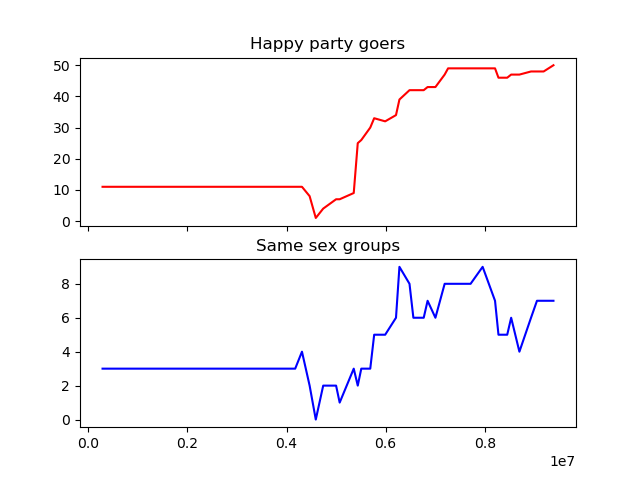

# Party Simulation

Right in the introduction of NetLogo's manual there's this example
model: [Party](http://ccl.northwestern.edu/netlogo/docs/sample.html).

This repo holds a re-write of that model.

# Why?

Well first of all we really don't need all the GUI stuff. But also
while running other NetLogo models we're facing some challenges:

- We need every iteration to copy agent states to a database, for
  realtime monitoring from GIS apps that read it. We've used the sql
  extention, tho it's sometimes kinda brittle.

- We want to run the simulation using all CPUs in our cluster. When
  using NetLogo we can use just those in a single box.

So I wrote this software to assess the effort required for rewritting
and overhauling NetLogo models. Hint: it's easy.

This version of the Party model is Object Oriented, i.e. *agents are
objects, their behaviours are methods, their states are
attributes*. The classes are built on top of an Object-Relational
Manager, so objects are kept in a relational database. The ORM makes
it easy to query the agents and it allows for a distributed
architecture.

 - [model.py](model.py) holds the class definitions.

 - [sim_setup.py](sim_setup.py) is the equivalent of NetLogo's setup
   routine. In this case it initializes the simulation by creating all
   necessary tables in the database.

 - [guest_agent.py](guest_agent.py) is the equivalent of the toGo stance,
   except it makes a single agent run. Each agent runs as a separate
   process, in this way we can use all available CPUs. They share the
   simulation space by being clients of the database server.

 - [sim_run_all_guests.py](sim_run_all_guests.py) will print out a
   command to run each guest agent. These commands end with an & so they
   will be run on the background. This script is meant to be piped to sh.

 - [sim_monitor.py](sim_monitor.py) periodically queries the database and
   logs collected samples of the simulation states.

# Example workflow

An example workflow can be seen in [sim_go.sh](sim_go.sh): this script setups a
simulation, a monitor and a bunch of agents and runs them all. It even
creates a plot like this one:

